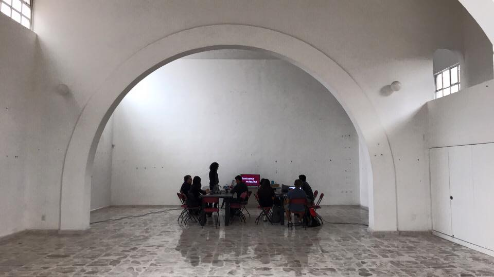

_Links:
[BEMA](https://derivelab.org/proyecto/bema/)_

Me gusta dar enseñar, intentar invadir de asombro sobre lo que me realmente me interesa. Por éso, a veces doy cursos, algunos pagados, otros gratuitos sobre programación.

El último que di fue en **BEMA**, en la ciudad de Querétaro. Impartí **Fantasma en la máquina: Programación para artistas**, el cual duró 3 días.

A los asistentes les mostré el uso de la programación como herramienta para la creación artística usando **Processing**.

