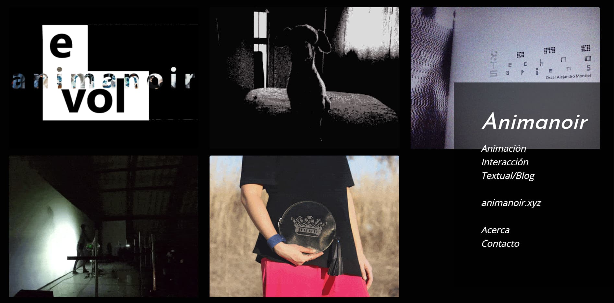

I've been prolonging my desire to write (I like to write a lot) concisely these weeks, but normally time doesn't permits me to write as consciously as I really want. First of all, I've been thinking in which language I should write these posts, and as you can see I've decided for english.

So...

There shouldn't be any doubt about the why since _everybody, professionally, talks in english_, right? Well, it was kind of a hard decision for me since I really love spanish; it feels so rich and diverse, filled with the exact words for the exact emotions. So I'll needed to find a balance... Some posts will be in english and others in spanish :~). This one, for foreign newcomers (and recruiters), will be, as you read, in english.

The purpose of this post is mainly to explain a bit about how this new website came to be, as well as its own challenges and learnings. My previous site, [animanoir.com](https://animanoir.com), was made like 5 years ago with the technologies I knew (and were available), exactly **Jekyll**, a static-site generator based on Ruby. It was a pain to use since it wasn't that easy to install everything it required to work in Windows (I still use W10, but got experience eventually with Ubuntu and Macs). I'm really proud of what I did.

What I loved is that **it really showed my personality**, something I've been trying to always do in any project I make by/for myself. Of course working on **teams is something great when everyone is in the same frequency**, so, in those cases, I contribute pieces of me to create a greater, collective whole.

So, for now it is mostly what I wanted to say. Thank you for reading until the end. Feel free to contact me at **omontiel@animanoir.com or etherealflux94@gmail.com**.
