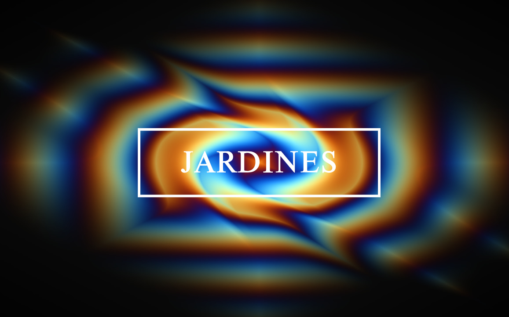

Links:
[Experiencia VR](https://maremoto.mx/) |
[otono.space/jardines/](https://otono.space/jardines/) |
[Since 66 by Vans](https://since66.mx/jardines-debuta-en-otono-con-un-nuevo-ep/)

**Alquitrán** es el EP del productor Jardines (Eduardo M. Márquez), artista multidisciplinario de Chihuahua, México, quien hace su debut en **OTONO**.

Se empleó `Three.js` como motor gráfico para el mundo virtual. En el lobby se optó por `Hydra`. Lo interesante fue encontrar una manera de embeber el canvas con Hydra de manera sencilla, así como mantener la densidad de píxeles adecuada para que se mantenga pulcra la imagen.

La intención de este proyecto fue sumergir al usuario dentro de un jardín virtual donde perderse fuera parte de la aventura, usando la música como guía para entender este mundo. Algo así como la vida real también.

El usuario puede moverse con el mouse o las teclas. Cada orbe es un `audioSource` de Three.js para facilitar la espacialización del audio: dependiendo de la posición del usuario en el entorno 3D, la música sonará más cerca o lejos, por la derecha o la izquierda. Inmersión.

Agradezco a Emmanuel Martínez por invitarme a colaborar en el proyecto.

