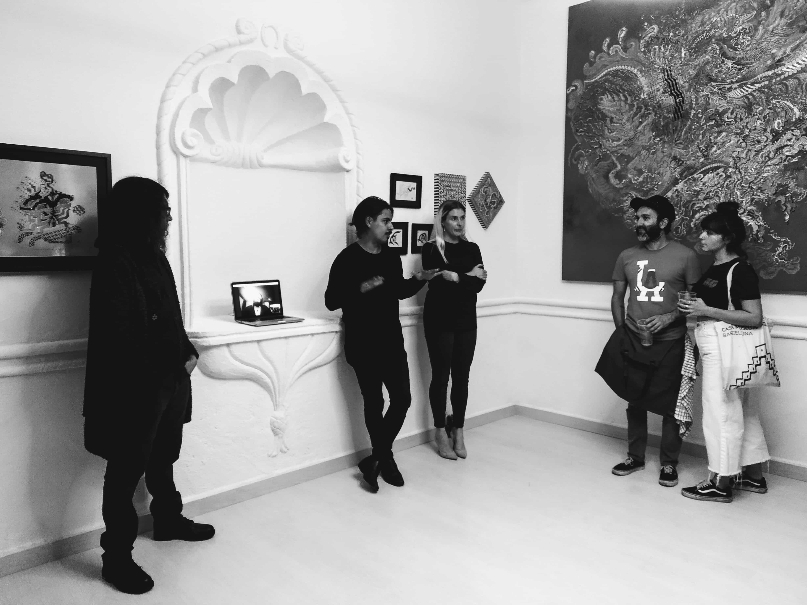
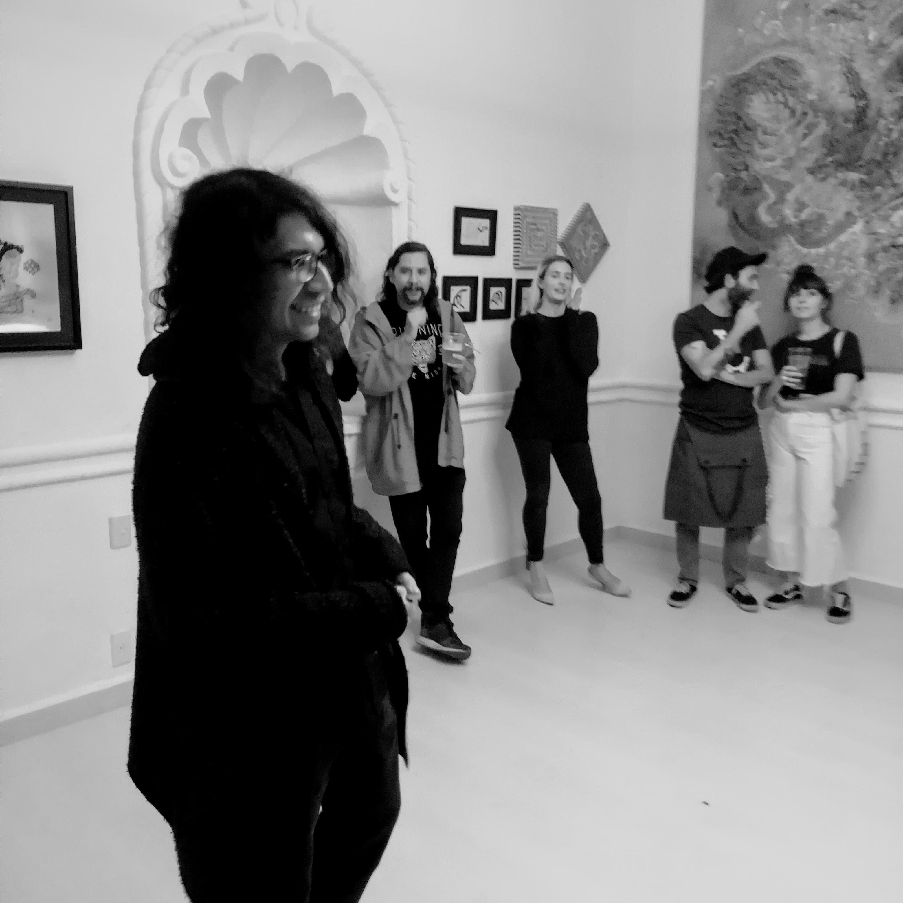

<iframe width="560" height="315" src="https://www.youtube-nocookie.com/embed/zP5tRs6Ewn0" frameborder="0" allow="accelerometer; autoplay; clipboard-write; encrypted-media; gyroscope; picture-in-picture" allowfullscreen></iframe>

With the advent of metamodern era (& coronavirus), one particular artist in the whole world had a great idea: why don't we move the art gallery to the web? So, we also joined the party :~)
Hence **ZeYX Lab** was born.

  
  
<small>Me, Emmanuel Martinez (trapped inside a computer) and Salvador Herrera.</small>

The idea was to have a virtual gallery that'd showcase (mostly) 3D art since the popularization of digital tooling for art creation.

  

