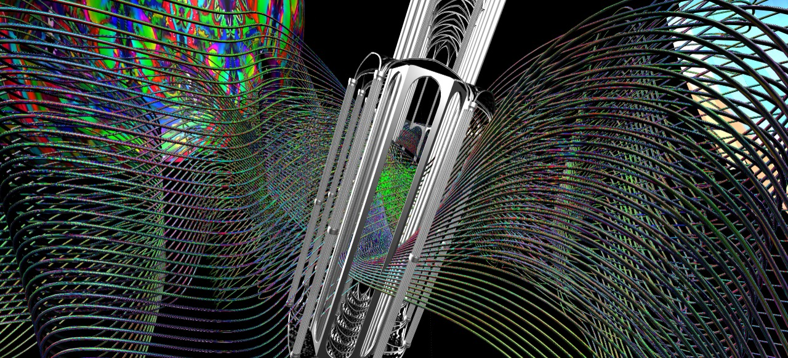
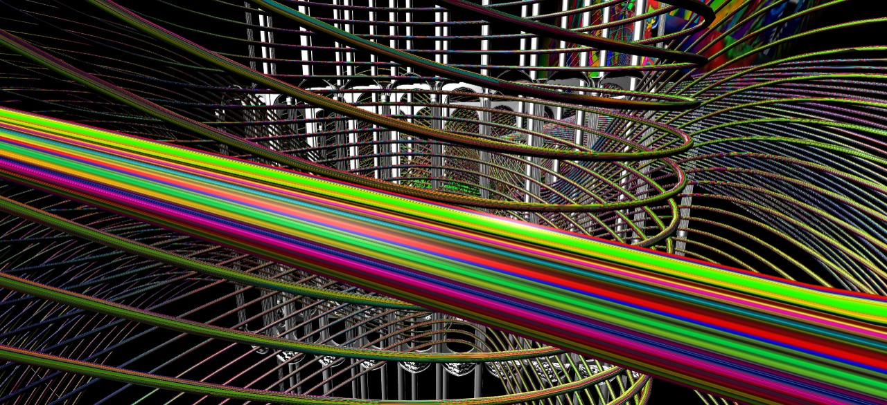

Foto de la portada por Emmanuel Martinez ·
<a href="https://zeyxlab.com/">ZeYX Lab (tarda en cargar por los assets)</a>

**ZeYX Lab** es un proyecto desarrollado entre [**Salvador Herrera**](https://outsiders.gallery/), [**Emmanuel Martínez** ](http://maremoto.mx/)y yo, donde exploramos las posibilidades post-2020 de apreciar arte en un mundo cada vez más virtualizado.

Desarrollado casi en su totalidad en **Three.js**, ZeYX es el prototipo de un espacio virtual enfocado en la navegación creativa dentro de los mares artístico-digitales.

El navegante puede flotar en la dirección que deseé con las teclas WASD, o bien haciendo click en el mouse.

Fue presentado en la inauguración de la galería [Outsiders Gallery](https://outsiders.gallery/) en Querétaro, México.

